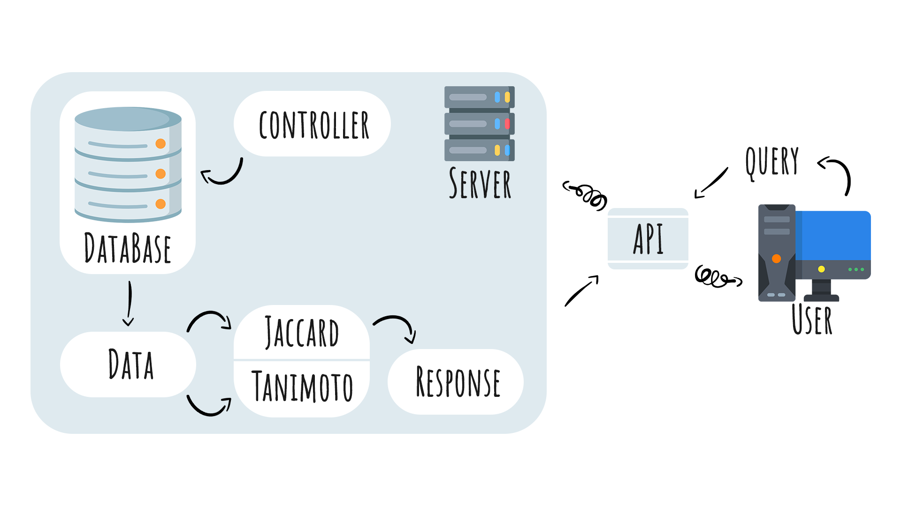

# Проект "{\*что-то\*} и точка".

## Актуальность:

Существующие на сегодняшний день методы поиска не отвечают потребностям рядовых пользователей; поиск на точное соответствие не позволяет найти слово, если в документе оно встречается в другой грамматической форме, а также, если были допущены ошибки при вводе информации. Одним из методов решения этих проблем является применение нечеткой логики при поиске.

Под нечетким поиском понимается возможность найти достаточно близкое приближение к запрошенному термину или фразе. Он устраняет для пользователя необходимость знать правильное написание каждого термина, с которым он работает. Нет необходимости пролистывать сотни страниц таблиц, заполненных корнями и основами ключевых слов, чтобы найти объект поиска. Также функциональным преимуществом является живой поиск.

## Проект:

Внедрение поиска основанного на принципах нечеткой логики в работу сайта с каталогом эфирных масел.

## Суть проекта:

Упрощение поиска эфирного масла по ключевым словам.

## Описание моделируемого бизнес-процесса:

Результат бизнес-процесса: результатом проекта является внедрение системы нечеткого поиска основанного на коэффициенте Жаккара и коэффициенте Танимото на сайт еще не придумали, на котором представлен каталог различных эфирных масел.

## Набор и порядок действий(этапы работы):

1. выбор метода для внедрения в систему;
1. формулировка технического задания(далее ТЗ);
1. сбор необходимых материалов для выполнения ТЗ;
1. распределение ролей в команде;
1. реализация;
1. тестирование готового продукта;
1. представление выполненного проекта;
1. редактирование проекта(если потребуется);

## HLD

### Структура

1. Формируем техническое задание

   Написать алгоритм использующий нечеткую логику для решения некоторых задач приложения;

1. Описываем дизайн системы и используемые средства

   В данном проекте мы используем комбинированный подход и таким образом достигаем большей эффективности. Также наше решение упрощает поиск нужного товара клиентом. Помимо этого, решение еще и ускоряет сам поиск. Также функциональным преимуществом является живой поиск.

1. Обосновываем функциональность внедряемых решений.

   В данном проекте мы используем комбинированный подход и таким образом достигаем большей эффективности. Также наше решение упрощает поиск нужного товара клиентом. Помимо этого, решение еще и ускоряет сам поиск.

1. Ключевые характеристики системы:

- Обработка неправильных запросов;
- возможность добавлять, удалять, получить всю базу и получить учитывая запрос;
- безопасный,так как не требует никакую личную информацию от пользователя,так же не хранит историю запросов после их обработки.

5. В проекте была использована база данных PostgreSQL.

   Преимущества PostgreSQL:

   - поддержка БД неограниченного размера;

   - мощные и надёжные механизмы транзакций и репликации;

   - расширяемая система встроенных языков программирования и поддержка загрузки C-совместимых модулей;

   - наследование;

   - легкая расширяемость.

6. Детальное описание компонентов вашей системы и протоколов межсервисного взаимодействия

   Пользователь передает через API запрос на сервер. С сервера переходим к базе данных и выгружаем ее. далее она обрабатывается в соответствии с алгоритмами нечеткого поиска, реализованных в программе. Полученный ответ через API возвращается к пользователю.



7. Пользовательский опыт

   - Безопасность. Системе не требуется никаких конфиденциальных данных и не хранит запросы пользователя, поэтому безопасен в использовании.

   - Стабильность. Система работает стабильно. Во время работы с сайтом не были замечены никакие сбои.

   - Скорость. Отклик на запрос практически моментальный.

   - Паттерность. Система интуитивно понятна, соответствует общепринятым интерфейсным и поведенческим паттернам.

   - Сервисность. В система предусмотрено два вида поиска: по имени и по ключевым словам. Данное решение дает пользователю больший функционал и более точный поиск нужного ему продукта.

   - Модность. Система отвечает современным тенденциям по части интерфейса и поведения.

8. Описание алгоритма нечеткой логики решающего задачу

   1. Для поиска по имени мы используем коэффициент Жаккара.

      Метод Жаккара или коэффициент сходства основан на идее того, что чем больше в строках одинаковых символов, тем больше вероятность того, что они похожи. Этот коэффициент вычисляется путем деления количества символов общих для двух строк на общее число символов в обеих строках.

      Тогда, представив множество символов первой строки как А, а множество символов второй строки как B, выразим меру Жаккара следующей формулой: KJ=|AB||AB| .

      Основной недостаток методов на основе множества общих символов состоит в том, что невозможно учесть порядок символов, поэтому в результате вывод одинаков для одинаковых строк и для инверсированных.

   2. Для поиска по ключевым словам было принято решение использовать комбинированный подход. В нем было реализовано вычисление расстояния Левенштейна и коэффициента Танимото.

      Комбинированный подход сводится к следующим шагам:

      - Нормализация сравниваемых предложений

      Строки переводятся в нижний регистр, удаляются все символы, отличные от букв, цифр и пробела.

      - Выделение слов

      Словами считаются все последовательности символов без пробелов, которые имеют длину >= 4. Этим самым удаляются почти все предлоги, союзы и тд. — в какой степени это можно отнести к продолжению нормализации.

      - Сравнение слов по подстрокам

      Коэффициент Танимото – описывает степень схожести двух множеств.

      а — количество видов на первой пробной площадке, b — количество видов на второй пробной площадке, с — количество видов, общих для 1-й и 2-й площадок.

      Здесь применяется коэффициент Танимото, но не к символам, а к кортежам из подряд идущих символов, причем кортежи составляются с нахлестом.

      - Применение коэффициента Танимото к заголовку

      Мы знаем сколько всего слов в каждом из предложений, знаем количество «нечётко совпадающих» слов и применяем к этому знакомую формулу.

9. Детальное описание процесса сборки и запуска приложения

## Запуск приложения

1. Склонировать код из [репозитория](https://github.com/KilRol/Essential-Oils-Backend)
2. Отредактировать в application.yaml поля
   - server.port
   - spring.datasource.url
   - spring.datasource.username
   - spring.datasource.password
3. Собрать проект с помощью команды ./gradlew jar
4. Запустить собранный файл в ./build/libs/essential-oils.jar

## Подготовка БД

1. Создать базу данных в PostgreSQL
2. (Опционально) Восстановить данные из bd_backup в созданную БД

## Взаимодействие с API

- Получить все записи из БД

  Отправить GET-запрос

      http://yourhost.name/api/products

- Получить запись из БД по ID

  Отправить GET-запрос

      http://yourhost.name/api/products/{id}

- Добавить запись в базу данных

  Отправить PUT-запрос с JSON следующей структуры

       http://yourhost.name/api/products/api/add

  ```JSON
    {
      "name": "product_name",                   //required
      "aroma": "product_aroma",                 //optional
      "description": "product_description",     //optional
      "usage": "product_usage",                 //optional
      "benefits": "product_benefits",           //optional
      "warnings": "product_warnings",           //optional
      "keywords": "product_keywords",           //optional
      "img": "product_img",                     //optional
      "id": "product_id"                        //optional
    }
  ```

  Обязательным является только поле "name", остальные - опциональны. Если передается значение в поле "id", то будет выполнено редактирование соответствующей записи в БД.

- Удалить запись из БД по ID

  Отправить DELETE-запрос

      http://yourhost.name/api/products/{id}

- Получить результаты поиска

  Отправить GET-запрос

  - Поиск по имени

        http://yourhost.name/api/products/search?q={REQUEST_BY_NAME}&type=0

  - Поиск по ключевым словам

        http://yourhost.name/api/products/search?q={REQUEST_BY_KEYWORDS}&type=1

- Получить похожие продукты по ID

  Отправить GET-запрос

      http://yourhost.name/api/products/{id}/similar

**Ссылка на [frontend-репозиторий](https://github.com/RenyxOne/Essential-Oils-Frontend)**
